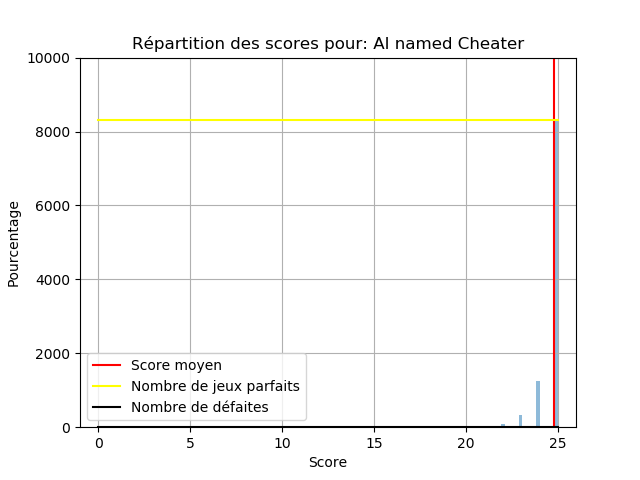

# Projet IN104 : Intelligence artificielle pour le jeu Hanabi

Ce projet à visée pédagogique avait pour buts l'acquisition de compétences en programmation et en gestion de projet:
* programmation orientée objet en Python
* prise en main d'un module préconçu par un autre programmeur
* extension de ce module et construction d'intelligence artificielle
* sensibilisation à la maintenabilité d'un code et à l'élaboration progressive de tests unitaires en cas de bugs
* initialisation à GitHub et ses fonctionnalités
* sensibilisation à l'utilisation de la syntaxe Markdown

## Ce que nous avons accompli pour ce projet

### Prise en main de Git, de la méthode de développement par tests et du module hanabi

L'enjeux de ce projet a d'abord été de comprendre comment fonctionne Git, ce qui ne fut pas chose facile. Puis nous avons été sensibilisé à l'utilisation de tests pour le debug, notamment en écrivant chacun des tests pour le module deck.
Cette phase de test du module deck a permis de comprendre plusieurs choses : nous avons compris un peu mieux ce que le module hanabi faisait et nous avons pu relever quelques bugs et autres entorses aux règles du jeu. 
De plus, cette phase de tests nous a fait comprendre qu'il était très compliqué d'écrire des tests sur un programme déjà écrit, qui plus est sur un module que nous venions à peine de prendre en main. Cela a mis en évidence l'interêt de faire les tests en même temps que l'écriture du code, car l'écriture des tests sur un module qu'on vient à peine de découvrir se résume surtout à des tests "à la main", suivi du debugging au fur et à mesure, ce que l'écriture des tests permet de systématiser. De plus à chaque modification les tests permettent de voir si en résolvant un problème on n'en a pas créé un autre.
Cependant, dans la pratique, on ne sait pas à l'avance tous les tests qu'on va vouloir faire, on en a une idée, puis c'est en testant à la main en lançant le programme qu'on se rend compte de certains problèmes, et qu'on peut écrire le test. La culture des tests n'étant pas encore vraiment implantée dans nos esprits, on a plutôt tendance à résoudre directement le bug. 
Il paraît cependant évident (mais il nous manque encore quelques réflexes) que la méthode de test-driven development permet *in fine* de gagner du temps pendant la phase de debug. Nous sommes encore loin cependant de maîtriser la méthode, mais nous y avons été grandement sensibilisé pendant ce projet.

### Evaluation des performances d'une intelligence artificielle

Bien que ce travail ait été fait plus tard dans la chronologie du projet, il est important de le signaler maintenant car il nous a permis une analyse plus quantitative des performances de nos différentes intelligences artificielles.
Nous avons donc réalisé une étude statistique sommaire des performances de l'IA Cheater pour débuter notre programme comparatif. Sur un nombre N de parties (N de l'ordre de 10 000 pour avoir une estimation raisonnable), nous avons relevé :
* le meilleur score
* le score le plus faible
* le score moyen (moyenne arithmétique)
* la fréquence d'apparition d'un score parfait (25)
* la fréquence d'apparition d'un échec (score nul)
Ces cinq informations nous permettent de classer les IA entre elles et surtout de percevoir les points forts et points faibles de chacune. 
*Exemple 1 : Cheater réalise un score parfait 90% du temps et a un score moyen égal à 24,7. Nous pouvons donc nous demander pourquoi un tricheur ne peux pas s'assurer un score parfait systématiquement.* 
*Exemple 2 : Doit-on préférer une IA ayant un bon score moyen mais qui échoue souvent à une IA ayant un socre moyen plus faible mais qui n'échoue jamais?*

### Conception d'une IA aléatoire

Le but de cette partie était essentiellement de prendre en main le module de jeu hanabi et l'intelligence artificielle tricheuse (Cheater) qui nous était proposée comme modèle. Tout l'intérêt d'une IA aléatoire repose bien entendu sur l'*absence de stratégie* à implémenter : notre travail s'est ainsi concentré sur la **syntaxe** particulière qu'impliquait le module hanabi et sur l'écriture de **tests unitaires** nous permettant de vérifier le bon fonctionnement de notre IA.

Ainsi, nous avons commencé par lui faire choisir une action au hasard parmi "play", "discard" et "clue", puis un autre choix aléatoire s'effectuait pour déterminer la carte à jouer, défausser ou sur laquelle donner un indice.
A ce stade de la conception, le reste du groupe commentait les possibilités qui s'offraient à nous pour pouvoir jouer à **plus de deux joueurs**. C'est pourquoi la phase de choix pour l'action "clue" s'est trouvée compliquée.
Très rapidement, nous nous sommes rendues compte des exigences imposées par le module, qui pouvaient différer les règles du jeu hanabi à proprement parler. 
*Exemple : le module interdit à un joueur de se défausser d'une carte si l'équipe possède déjà 8 jetons bleus. Même si cette action n'est pas recommandée, elle n'est pas formellement interdite par les règles du jeu*
Nous avons donc fait évoluer cette IA afin qu'elle joue plutôt comme un humain stupide : elle connait les règles du jeu tel qu'implémentées dans le module et n'effectue pas une action qui ferait échouer la partie. Elle joue en priorité une carte si elle sait que celle-ci est correcte. Sinon elle joue aléatoirement : elle joue une carte de manière aléatoire parmi celle dont elle ne connaît rien (mais évite de jouer une carte qu'elle sait va faire échouer la partie) elle donne un indice aléatoire parmi les indices que l'autre joueur ne connaît pas encore, ou alors elle se défausse d'une carte de manière aléatoire. Ces actions ne prennent en compte aucune stratégie, excepté d'éviter de faire échouer la partie.

Nous pouvons résumer ses perfomances par le graphique suivant:

 

Finalement cette IA oscille entre des performances médiocres et honorable, un peu comme un humain qui viendrait de découvrir le jeu et qui pourtant réfléchi : finalement l'aléatoire est parfois aussi efficace que la réflexion lorsque celle-ci est mal manée.

### Conception d'une IA utilisant la stratégie de recommandation 
La stratégie utilisée par cette IA est décrite dans le document suivant: [HanSim : the Hat Guessing Strategy](https://sites.google.com/site/rmgpgrwc/research-papers/Hanabi_final.pdf?attredirects=1)

Cette stratégie est plus facile à appréhenser par un ordinateur car elle est systématique : elle repose en effet sur la méthode de maximisation de réponses justes dans le jeu des chapeaux (cf source). Pour résumer, un indice n'est plus destiné à informer un joueur en particulier sur le contenu de sa main mais plutôt à informer tous les joueurs sur ce que chacun devrait faire dans l'état actuel du jeu.

Il a donc été nécessaire d'établir une bijection entre le type d'indice donné et l'action associée. Cette bijection était proposée dans le document source pour le cas d'un jeu à cinq joueurs mais nous avons dû adapter la méthode pour un nombre plus faible de joueurs et, par conséquent des mains contenant plus de cartes. N'oublions pas non plus que tous les indices ne sont pas valables à tout instant : la règle du jeu impose qu'on ne peut pas donner un indice sur une couleur et/ou un numéro qui ne se trouve pas effectivement dans la main du joeur à qui on s'adresse.

Nous avons également remarqué que cette stratégie n'est payante que si tous les joueurs autour de la table adoptent la même. Nous ne pouvons donc pas faire jouer une IA adoptant cette stratégie à la même table qu'une IA tricheuse.

**à remplir  par Camille et Mathilde**

Résultats obtenus après une première phase de conception

**évolutions à remplir par Camille**

Résultats obtenus après une phase de correction

### Conception d'une IA utilisant la stratégie d'information
La stratégie utilisée par cette IA est décrite dans le document suivant: [HanSim : the Hat Guessing Strategy](https://sites.google.com/site/rmgpgrwc/research-papers/Hanabi_final.pdf?attredirects=1)

**à remplir par Ruonan**
*pour t'aider si nécessaire :
part 1 : spécificité de ta stratégie
part 2 : difficultés pour la mise en algorithme
part 3 : problèmes rencontrés
part 4 : solutions apportées
part 5 : problèmes restants, pistes pour les résoudre?*

Résultats obtenus pour l'IA avec stratégie d'information **s'il y en a**

## Conclusion

some bullshit sentences to conclude
