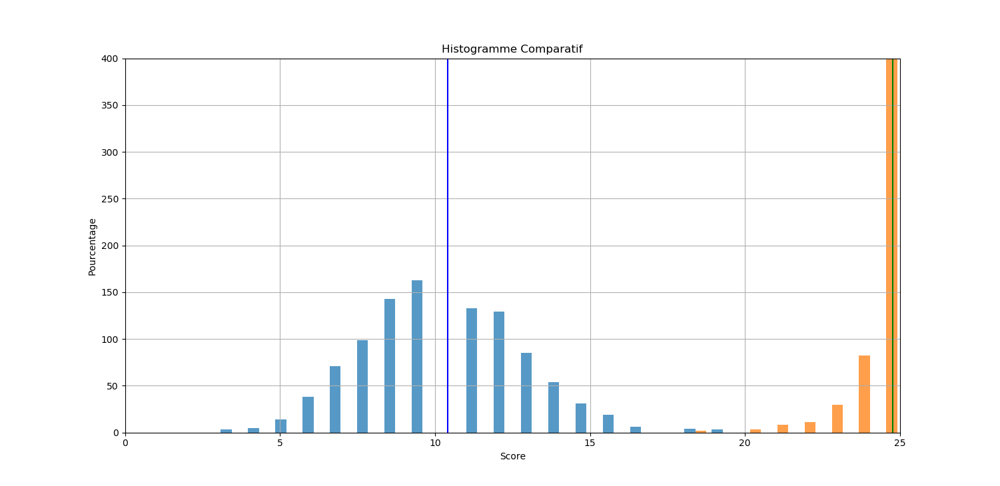
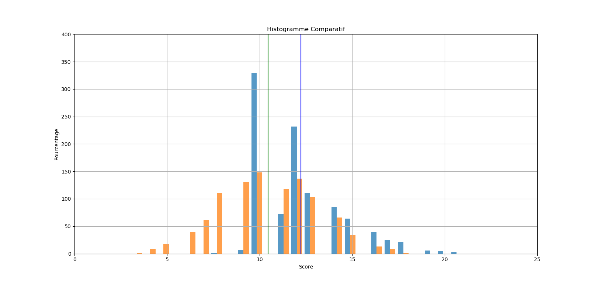

# Projet IN104 : Intelligence artificielle pour le jeu Hanabi

Ce projet à visée pédagogique avait pour buts l'acquisition de compétences en programmation et en gestion de projet:
* programmation orientée objet en Python
* prise en main d'un module préconçu par un autre programmeur
* extension de ce module et construction d'intelligence artificielle
* sensibilisation à la maintenabilité d'un code et à l'élaboration progressive de tests unitaires en cas de bugs
* initialisation à GitHub et ses fonctionnalités
* sensibilisation à l'utilisation de la syntaxe Markdown

## Concepts importants de ce cours

### Prise en main de Git

L'enjeu de ce projet a d'abord été de comprendre comment fonctionne Git, ce qui ne fut pas chose facile. Mais une fois cet outil correctement appréhendé, nous avons pu en découvrir toute la puissance et l'utilité. Il nous a notamment permis de travailler chacune de notre coté sans interférences. Mais surtout, grâce au **fork** nous avons pu bénéficier des changements apportés par les autres groupes sans pour autant perdre nos propres améliorations.

## Méthode de développement par tests et module hanabi

Nous avons été sensibilisées dans un deuxième temps à l'utilisation de tests pour le debug, notamment en écrivant chacun des tests pour le module deck.
Cette phase de test a permis de comprendre plusieurs choses. D'une part, nous avons compris un peu mieux ce que le module hanabi faisait et d'autre part nous avons pu relever quelques bugs et autres entorses aux règles du jeu. 
De plus, cette phase de tests nous a fait comprendre qu'il était délicat d'écrire des tests sur un programme déjà écrit, qui plus est sur un module que nous venions à peine de prendre en main. Cela a mis en évidence l'intérêt de faire les tests en même temps que l'écriture du code, car l'écriture des tests sur un module qu'on vient à peine de découvrir se résume surtout à des tests "à la main", suivi du debugging au fur et à mesure, ce que l'écriture synchrone du code et des tests permet de systématiser. D'autre part, les tests permettent à chaque modification de voir si en résolvant un problème un autre n'a pas été créé.
Cependant, en pratique, il est difficile de prévoir tous les tests à effectuer et c’est en lançant le programme qu’on se rend compte de certains problèmes et qu’on peut écrire les tests correspondants. 

## Ce que nous avons accompli pour ce projet

### Evaluation des performances d'une intelligence artificielle

Bien que ce travail ait été fait plus tard dans la chronologie du projet, il est important de le signaler maintenant car il nous a permis une analyse plus quantitative des performances de nos différentes intelligences artificielles.

Nous avons donc réalisé une étude statistique sommaire des performances de l'IA Cheater pour débuter notre programme comparatif. Sur un nombre N de parties (N de l'ordre de 1 000 pour avoir une estimation raisonnable), nous avons relevé :
* le meilleur score
* le score le plus faible
* le score moyen (moyenne arithmétique)
* la fréquence d'apparition d'un score parfait (25)
* la fréquence d'apparition d'un échec (score nul)

Ces cinq informations nous permettent de classer les IA entre elles et surtout de percevoir les points forts et points faibles de chacune.

*Exemple 1 : Cheater réalise un score parfait 86.4% du temps et a un score moyen égal à 24,7. Nous pouvons donc nous demander pourquoi un tricheur ne peux pas s'assurer un score parfait systématiquement.* 

*Exemple 2 : Doit-on préférer une IA ayant un bon score moyen mais qui échoue souvent à une IA ayant un socre moyen plus faible mais qui n'échoue jamais?*

### Remarques sur l'IA tricheuse Cheater

L'IA Cheater, bien qu'elle obtienne des résultats assez impressionnants, n'obtient pas 100% de réussite. En effet, parfois la configuration du jeu fait que parfois, le joueur est obligé de se débarasser d'une carte indispensable, par exemple un 5, car il n'a pas d'autre possibilité. Le jeu ne peut donc plus être parfait.

### Conception d'une IA aléatoire

Le but de cette partie était essentiellement de prendre en main le module de jeu hanabi et l'intelligence artificielle tricheuse (Cheater) qui nous était proposée comme modèle. Tout l'intérêt d'une IA aléatoire repose bien entendu sur l'*absence de stratégie* à implémenter : notre travail s'est ainsi concentré sur la **syntaxe** particulière qu'impliquait le module hanabi et sur l'écriture de **tests unitaires** nous permettant de vérifier le bon fonctionnement de notre IA.

Ainsi, nous avons commencé par lui faire choisir une action au hasard parmi "play", "discard" et "clue", puis un autre choix aléatoire s'effectuait pour déterminer la carte à jouer, défausser ou sur laquelle donner un indice.
A ce stade de la conception, le reste du groupe commentait les possibilités qui s'offraient à nous pour pouvoir jouer à **plus de deux joueurs**. C'est pourquoi la phase de choix pour l'action "clue" s'est trouvée compliquée.
Très rapidement, nous nous sommes rendues compte des exigences imposées par le module, qui pouvaient différer les règles du jeu hanabi à proprement parler. 

*Exemple : le module interdit à un joueur de se défausser d'une carte si l'équipe possède déjà 8 jetons bleus. Même si cette action n'est pas recommandée, elle n'est pas formellement interdite par les règles du jeu*

Nous avons donc fait évoluer cette IA afin qu'elle joue plutôt comme un humain stupide : elle connait les règles du jeu tel qu'implémentées dans le module et n'effectue pas une action qui ferait échouer la partie. Elle joue en priorité une carte si elle sait que celle-ci est correcte. Sinon elle joue aléatoirement : elle joue une carte de manière aléatoire parmi celle dont elle ne connaît rien (mais évite de jouer une carte qu'elle sait va faire échouer la partie) elle donne un indice aléatoire parmi les indices que l'autre joueur ne connaît pas encore, ou alors elle se défausse d'une carte de manière aléatoire. Ces actions ne prennent en compte aucune stratégie, excepté d'éviter de faire échouer la partie.

Nous pouvons résumer ses perfomances par le graphique suivant (comparées avec les performances de l'AI Cheater):

 

*Les stats sont données pour 4 joueurs mais ce graphique est similaire pour n'importe quel nombre de joueurs*

Finalement cette IA oscille entre des performances médiocres et honorables, un peu comme un humain qui viendrait de découvrir le jeu et qui pourtant réfléchit : finalement l'aléatoire est parfois aussi efficace que la réflexion lorsque celle-ci est mal manée.

### Conception d'une IA utilisant la stratégie de recommandation 
La stratégie utilisée par cette IA est décrite dans le document suivant: [HanSim : the Hat Guessing Strategy](https://sites.google.com/site/rmgpgrwc/research-papers/Hanabi_final.pdf?attredirects=1)

(stratégie à 5 joueurs donc 4 cartes dans chaque main)
* Chaque indice correspond à une action : 
    0. jouer carte 1 // indice de rang sur la carte 1
    1. jouer carte 2 // indice de rang sur la carte 2
    2. jouer carte 3 // indice de rang sur la carte 3
    3. jouer carte 4 // indice de rang sur la carte 4
    4. se débarasser carte 1 // indice de couleur sur la carte 1
    5. se débarasser carte 2 // indice de couleur sur la carte 2
    6. se débarasser carte 3 // indice de couleur sur la carte 3
    7. se débarasser carte 4 // indice de couleur sur la carte 4

* Trois catégories de cartes : Playable ; Dead ; Indispensable.

* Priorités des indices à donner : 
    1. Faire jouer une Playable de rang 5 (d'index 1 2 3 4 minimal)
    2. Faire jouer une playable de rang minimal (d'index minimal si litige)
    3. Faire se débarasser d'une Dead avec index min.
    4. Faire se débarasser d'une carte non Indispensable avec le rang le plus haut (index min si litige)
    5. Faire se débarasser de la carte 1 de la main. (indice n°4)

Chaque main est associée à un nombre de 0 à 7 suivant l'ordre de priorité ci-dessus.

Le joueur voulant faire la recommandation donne l'indice correspondant à la somme des indices pour chaque joueur modulo 8.
/!\ chaque recommandation concerne l'instant présent et n'est plus valable une fois qu'une action a été faite.

* Solution pour y remédier (ordre de priorité):
    1. Si le dernier indice reçu était de jouer une carte et qu'aucune carte n'a été jouée depuis le dernier indice, jouer la carte indiquée.
    2. Si une carte a été jouée et que les joueurs ont fait moins de 2 erreurs, jouer la carte.
    3. Si les joueurs ont des jetons d'indice, donner un indice.
    4. Si l'indice était de se débarasser d'une carte, se débarasser de la carte.
    5. Se débarasser de la carte n°1

Nous avons remarqué que cette stratégie n'est payante que si tous les joueurs autour de la table adoptent la même. Nous ne pouvons donc pas faire jouer une IA adoptant cette stratégie à la même table qu'une IA tricheuse.

**Première phase de conception**

Cette stratégie est plus facile à appréhender par un ordinateur car elle est systématique : elle repose en effet sur la méthode de maximisation de réponses justes dans le jeu des chapeaux (cf source). Pour résumer, un indice n'est plus destiné à informer un joueur en particulier sur le contenu de sa main mais plutôt à informer tous les joueurs sur ce que chacun devrait faire dans l'état actuel du jeu.

Il a donc été nécessaire d'établir une bijection entre le type d'indice donné et l'action associée. Cette bijection était proposée dans le document source pour le cas d'un jeu à cinq joueurs mais nous avons dû adapter la méthode pour un nombre plus faible de joueurs et, par conséquent des mains contenant plus de cartes. N'oublions pas non plus que tous les indices ne sont pas valables à tout instant : la règle du jeu impose qu'on ne peut pas donner un indice sur une couleur et/ou un numéro qui ne se trouve pas effectivement dans la main du joeur à qui on s'adresse.

Cependant la stratégie telle qu'implémentée ne fonctionne qu'avec deux joueurs et ne renvoie pas du tout les bonnes actions ce qui la fait perdre très souvent :

Nous avons donc dû prendre du recul par rapport à notre IA pour comprendre ce qui clochait.

**Deuxième phase de conception**

La première IA ne suivait pas exactement la stratégie décrite par the Hat Guessing Game : en effet, la relation entre les indices et les actions à faire dépendait entièrement de l'indice et non de la position de la carte sur laquelle on donnait l'indice (ce qui n'est pas possible dans la vraie à moins que tous les joueurs ne jouent en connaissant la correspondance entre chaque indice et les actions, ce qui est équivalent à directement communiquer l'action à faire). 
Il manquait de plus quelques fonctions d'interprétation des indices et certaines boucles présentaient des bug qui ont été corrigés dans cette deuxième version.

Cependant, même en faisant ces améliorations, on se rend compte que la fonction play du module AI, ne garde pas du tout en mémoire la configuration du jeu lorsque l'on donne l'indice. En effet, pour que l'indice soit valable il faut le calculer au moment où il a été donné. Or lorsque c'est le tour d'un joueur, la configuration de la partie a déjà changé, il ne peut plus calculer sa propre action, puisqu'il faut pour cela calculer les actions optimales des autres joueurs, actions qui ont peut-être changé, s'ils ont eux-même joué ou s'ils ont défaussé leurs cartes. 

Comme nous étions limités en temps, au lieu de garder la configuration en mémoire et de recalculer à chaque fois toutes les actions puis faire un modulo, nous avons préféré directement garder en mémoire la liste des indices pour chaque joueur. Certes c'est un peu de la triche, mais c'est uniquement un raccourci en admettant que chaque joueur réussit à calculer son propre indice. Puisque les fonctions de calcul d'action optimale (value_hand) sont les mêmes (qu'il s'agisse de donner un indice ou de calculer les indices des autres pour trouver le sien), cela revient au même. 

L'efficacité de la stratégie en elle-même repose plutôt sur l'ordre de priorité des actions. Cependant nous sommes confrontés à d'autres difficultés, notamment dans une partie à deux joueurs (mais le cas de figure peut également se présenter à plusieurs) : le premier joueur donne un indice avec le dernier jeton bleu, le joueur suivant joue sa carte, il n'y a plus de jetons bleus, donc le joueur 1 se défausse au lieu de donner un indice, le joueur 2 regarde les indices donnés précédemment, sans se rendre compte qu'ils ne sont plus à jour et joue de nouveau, au risque de récolter un jeton rouge. 
Pour y remédier, nous avons rajouté une condition, qui oblige le joueur 2 à donner un indice au lieu de jouer bêtement (ou à se défausser mais dans ce cas de figure, le joueur 1 ayant discard, on a 1 jeton bleu), la variable GAME_CHANGED était censée remplir cette fonction, (edit : cela a été modifié entre temps, mais on a laissé en commentaire cette boucle).
Cette configuration peut se trouver à plus de deux joueurs, mais c'est plus rare.
Même en remarquant ce détail, la stratégie décrite est bien moins efficace à deux joueurs qu'à 3, 4 ou 5 joueurs.

Résultats obtenus à la deuxième phase de conception : 

Comparaison avec les autres IA que nous avons développé :

### Conception d'une IA utilisant la stratégie d'information
La stratégie utilisée par cette IA est décrite dans le document suivant: [HanSim : the Hat Guessing Strategy](https://sites.google.com/site/rmgpgrwc/research-papers/Hanabi_final.pdf?attredirects=1)

**à remplir par Ruonan**
*pour t'aider si nécessaire :
part 1 : spécificité de ta stratégie
part 2 : difficultés pour la mise en algorithme
part 3 : problèmes rencontrés
part 4 : solutions apportées
part 5 : problèmes restants, pistes pour les résoudre?*

Résultats obtenus pour l'IA avec stratégie d'information **s'il y en a**

## Conclusion

Ce projet nous permis d’acquérir des compétences de gestions de projet informatique et nous a sensibilisé à la méthode de test-driven development permet *in fine* de gagner du temps pendant la phase de debug. Cependant, la culture des tests n'étant pas encore vraiment implantée dans nos esprits, nous avons encore tendance à résoudre directement le bug, même s’il est évident que cette méthode est des plus efficaces.

Nous avons d’un autre coté rencontré des difficultés d’organisation. En effet, nous ne pouvions pas développer une IA à deux ou trois et nous avons pour ainsi dire adopté deux stratégies qui ont chacune leurs défauts. Pour Random et Recom l’une d’entre nous a fait la première phase de conception et la structure globale du code, puis a laissé sa place une deuxième  pour la phase de tests. A l’inverse, l’IA Strat_info a été développée et débuggée par la troisième d’entre nous.

La première stratégie  nous a obligé à faire de nombreux allers et retours sur le code, et nous a fait perdre beaucoup de temps pour la phase de debugging, car nous n’avions pas toutes la même façon de penser l’IA. Mais nous nous sommes aussi rendues compte que concevoir et debugger une IA était un travail de titan, difficile à accomplir seule dans le temps qui nous était imparti.

Nous dirons pour terminer que ce projet a été scolairement et humainement instructif et que les nombreuses possibilités qui s’offrent encore au programmeur sont tentantes : pourquoi ne pas les explorer pour le plaisir ?

